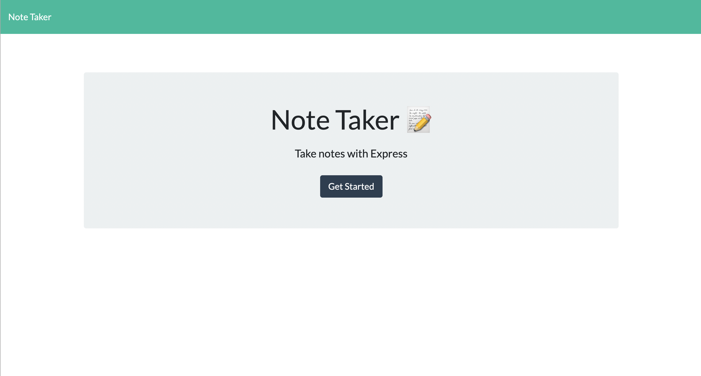
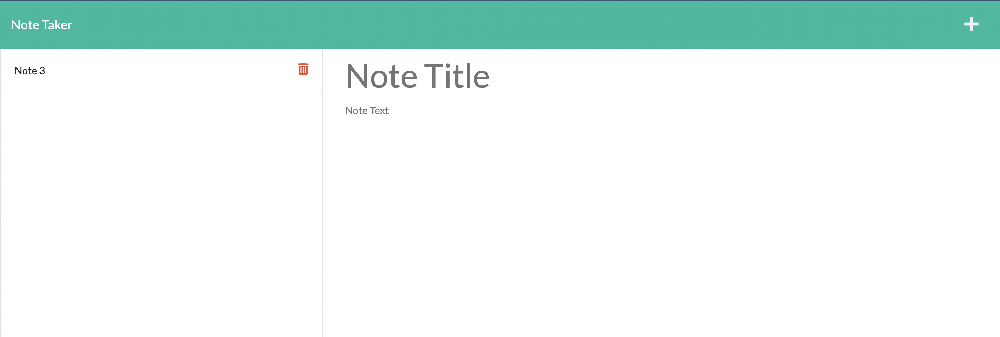
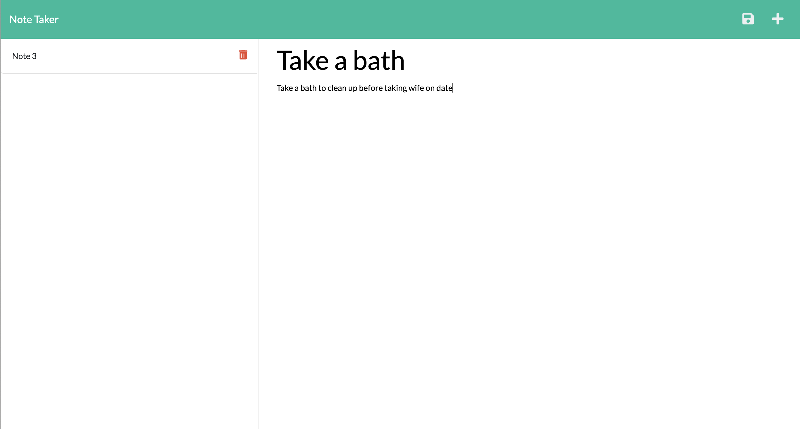
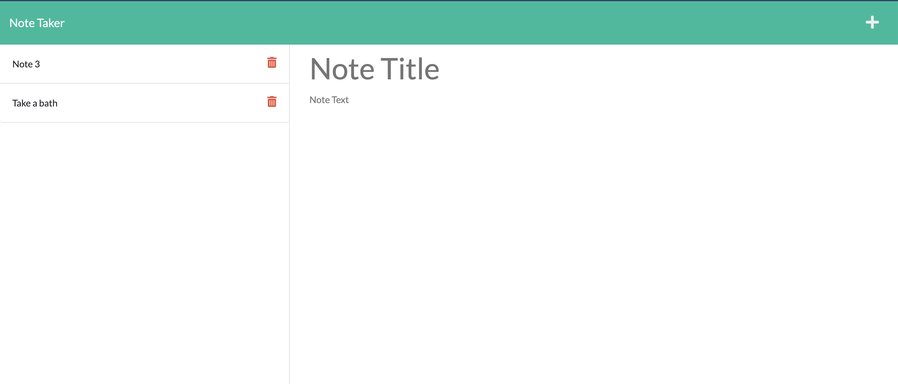
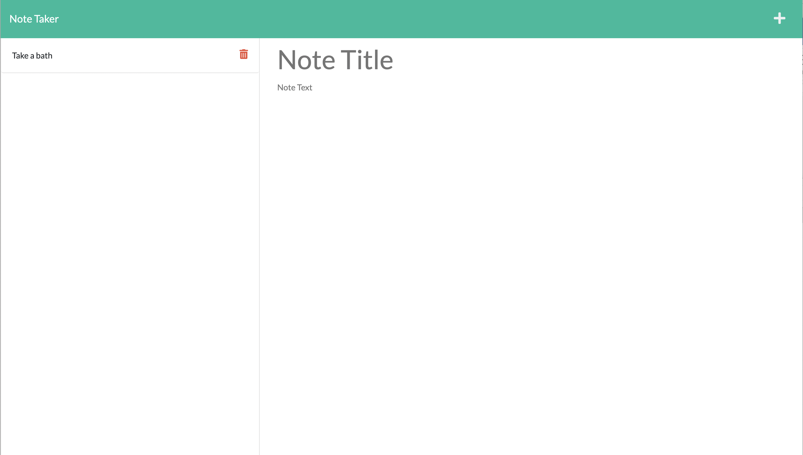

# Note Take

 ## Description

 This application was created to allow the user to create, view and delete notes, which are saved in a json file with unique IDs in the backend. The app uses a server to route the user's requests and to serve the html.  This project demonstrates use of Express.js.

## Table of Contents

  
  - [Installation](#installation)
  - [Usage](#usage)
  - [Contributing](#contributing)
  - [Tests](#tests)
  - [License](#license)
  - [Questions](#questions)

  ## Installation

  The user should clone the repository from GitHub and download Node. This application also requires a file system, Express and UUID modules. 

  ## Usage

  The application has been deployed using Heroku and is easy to use.  Simply click on the following link to lauch the application: <a href="https://young-waters-88771.herokuapp.com/">Note Taker Application</a>

Screen Shots of the App:

  ## Contributing

  All comments and suggestions will be carefully considered and will be greatly appreciated.

  ## Tests

 Try the applcation in your brower.

  ## Questions

  My Github page is: https://github.com/greenmanaustin

  You can reach me with questions at: sheroo.bhagia@gmail.comr Starter Code